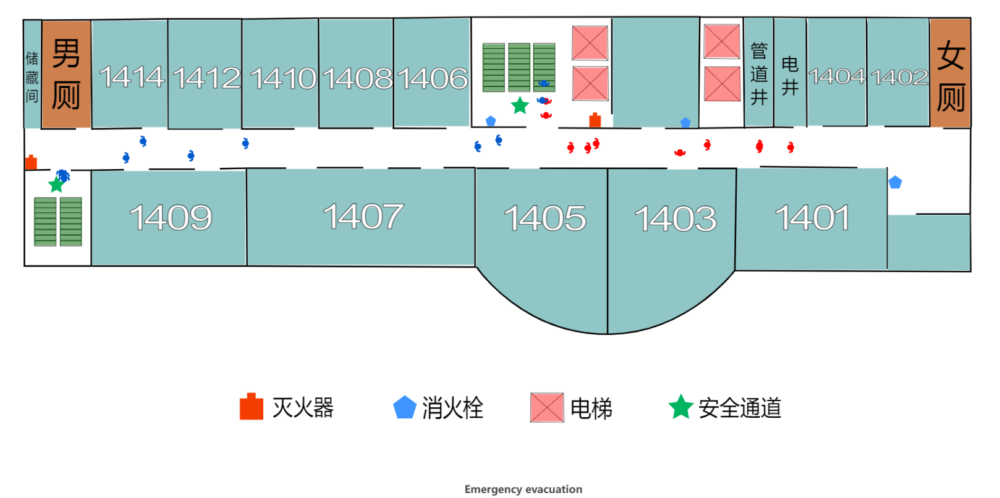

# Emergency evacuation
This is a simple emergency evacuation scene rendered by Echarts, and the base drawing is drawn by Adobe Illustrator. 

The building structure is derived from No. 4 Teaching Building of Mfangshan Campus of Wuhan University of Technology.

> You must have Python 2.7 or later installed
## The front-end display

